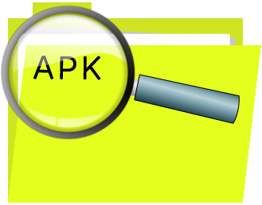

<p align="center">
    
    <h1 align="center">analyze_apk plugin</h1>
</p>
<p align="center">
    <a href="https://rubygems.org/gems/fastlane-plugin-analyze_apk"></a>
    <a href="https://rubygems.org/gems/fastlane-plugin-analyze_apk"></a>
    <a href="https://rubygems.org/gems/fastlane-plugin-analyze_apk"></a>
</p>

## Getting Started
This project is a [_fastlane_](https://github.com/fastlane/fastlane) plugin. To get started with `fastlane-plugin-analyze_apk`, add it to your project by running:

```bash
fastlane add_plugin analyze_apk
```

## About analyze_apk
Analyze APK extracts usefull information about your generated APK.

**Options:**

**Key**|**Description**
-----|-----
apk\_path|Path to the apk you want to inspect
android\_home|Path to the root of your Android SDK installation, e.g. ~/tools/android-sdk-macosx
build\_tools\_version|The Android build tools version to use e.g. '23.0.2'

**Output variables:**

**SharedValue**|**Description**
-----|-----
ANALYZE\_APK\_PACKAGE\_NAME|APK's package name
ANALYZE\_APK\_VERSION\_CODE|APK's version code
ANALYZE\_APK\_VERSION\_NAME|APK's version name
ANALYZE\_APK\_APP\_NAME|App's name
ANALYZE\_APK\_MIN\_SDK|APK's minimal sdk version
ANALYZE\_APK\_SIZE|APK's size (bytes)

* You can access these values using: ```lane_context[SharedValues::VARIABLE_NAME]```

## Example
The following lane creates an apk using the [gradle action](https://docs.fastlane.tools/actions/#gradle) then it takes the generated apk and runs ```analyze_apk``` on it (using a ```SharedValue``` set by the gradle action):

```ruby
fastlane_version "2.39.2"

default_platform :android

platform :android do

  desc "Create an apk and print information about it"
  lane :apk do
    gradle( #builds your apk
      task: "assembleRelease"
    )
    analyze_apk(
      android_home: 'path/to/your/Android/sdk',
      build_tools_version: '23.0.2',
      apk_path: lane_context[SharedValues::GRADLE_APK_OUTPUT_PATH]
    )
    puts("Version name: #{lane_context[SharedValues::ANALYZE_APK_VERSION_NAME]}")
    puts("Package name: #{lane_context[SharedValues::ANALYZE_APK_PACKAGE_NAME]}")
    puts("Version code: #{lane_context[SharedValues::ANALYZE_APK_VERSION_CODE]}")
    puts("App name: #{lane_context[SharedValues::ANALYZE_APK_APP_NAME]}")
    puts("Minimum sdk: #{lane_context[SharedValues::ANALYZE_APK_MIN_SDK]}")
    puts("Apk size: #{lane_context[SharedValues::ANALYZE_APK_SIZE]} bytes")
  end
end
```

## Issues and Feedback

For any other issues and feedback about this plugin, please submit it to this repository.

## Troubleshooting

If you have trouble using plugins, check out the [Plugins Troubleshooting](https://docs.fastlane.tools/plugins/plugins-troubleshooting/) guide.

## Using _fastlane_ Plugins

For more information about how the `fastlane` plugin system works, check out the [Plugins documentation](https://docs.fastlane.tools/plugins/create-plugin/).

## About _fastlane_

_fastlane_ is the easiest way to automate beta deployments and releases for your iOS and Android apps. To learn more, check out [fastlane.tools](https://fastlane.tools).
